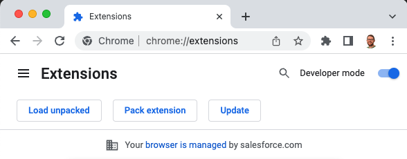
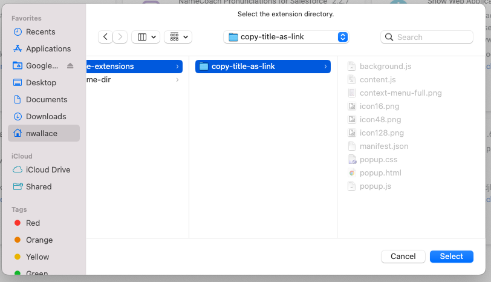
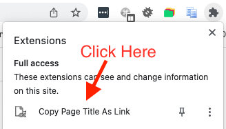

# Copy Title As Link
This repo houses a Chrome Extension that you can load into your browser
to gain a context menu item and a shortcut key ("hotkey") that will
copy the current page's title as a hyperlink to the page. Then, you can
paste that link into Google Docs, Slack, Quip, or wherever else receives
rich text to share links.

## How to install
Clone this git repo (example below clones into
`~/src/chrome-extensions/copy-title-as-link`):
```
mkdir -p ~/src/chrome-extensions
cd ~/src/chrome-extensions
git clone git@github.com:nathanbw/copy-title-as-link.git
cd -
```

Go to `chrome://extensions` (copy-paste that into you URL bar), toggle "Developer
mode" on (top right corner of the page), then click on "Load Unpacked" (top left
corner of the page)



Select the directory you cloned this repo into:



After the extension is loaded, you can click on it in the extension menu to see its
popup; it has information on how to use the extension


